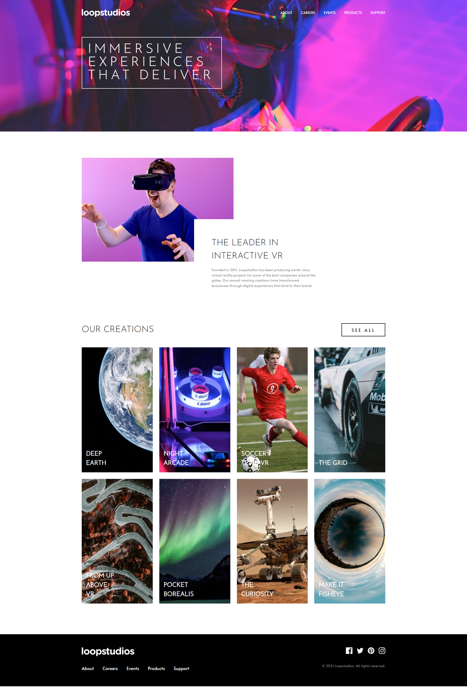

# Frontend Mentor - Loopstudios landing page solution

This is a solution to the [Loopstudios landing page challenge on Frontend Mentor](https://www.frontendmentor.io/challenges/loopstudios-landing-page-N88J5Onjw). Frontend Mentor challenges help you improve your coding skills by building realistic projects. 

## Table of contents

- [Overview](#overview)
  - [The challenge](#the-challenge)
  - [Screenshot](#screenshot)
  - [Links](#links)
- [My process](#my-process)
  - [Built with](#built-with)
  - [What I learned](#what-i-learned)
  - [Continued development](#continued-development)
  - [Useful resources](#useful-resources)
- [Author](#author)

## Overview

### The challenge

Users should be able to:

- View the optimal layout for the site depending on their device's screen size
- See hover states for all interactive elements on the page

### Screenshot

### Links

- Solution URL: [Github repository](https://github.com/Robertron624/loopstudios-landing-page)
- Live Site URL: [Netlify Live Site](https://calm-pithivier-7b2729.netlify.app/)

## My process

### Built with

- Semantic HTML5 markup
- CSS custom properties
- Flexbox
- CSS Grid
- Mobile-first workflow

### What I learned

I kept improving my layout skills with this project, also I used the srcet for image responsivity overall It was a fun project to work with.

### Continued development

I want to keep improving my layout skills and also my responsiveness skills. I also want to start working in multiple pages projects.s
## Author

- Personal Website - [Robert Ramirez](https://robert-ramirez.netlify.app)
- Frontend Mentor User- [@Robertron624](https://www.frontendmentor.io/profile/Robertron624)
- Twitter - [@robertdowny](https://www.twitter.com/robertdowny)
